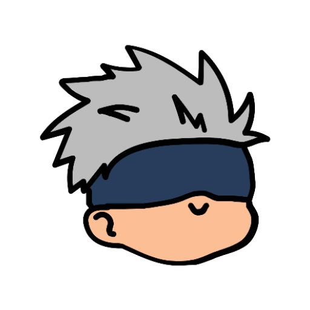
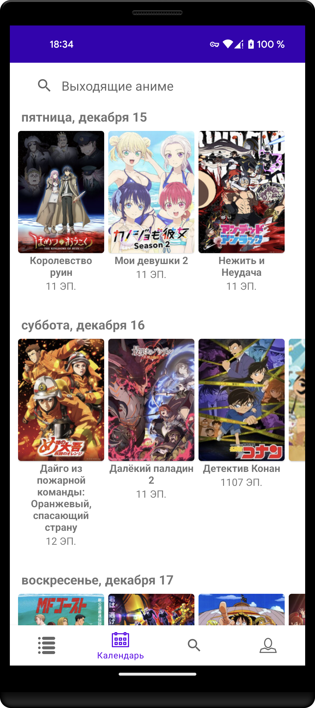
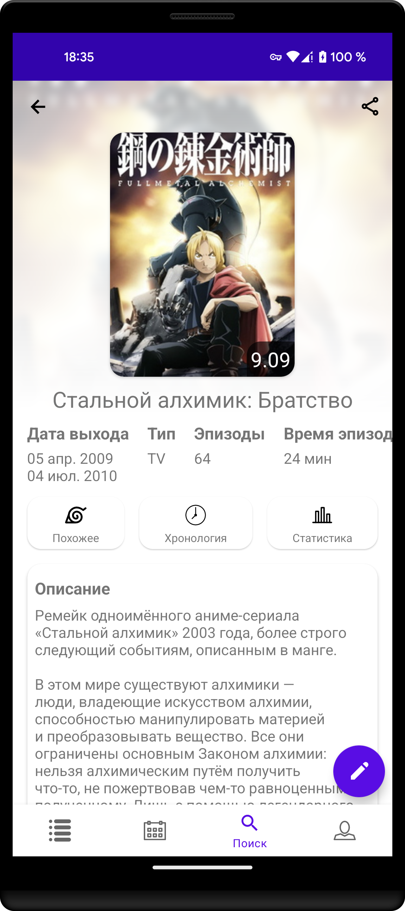
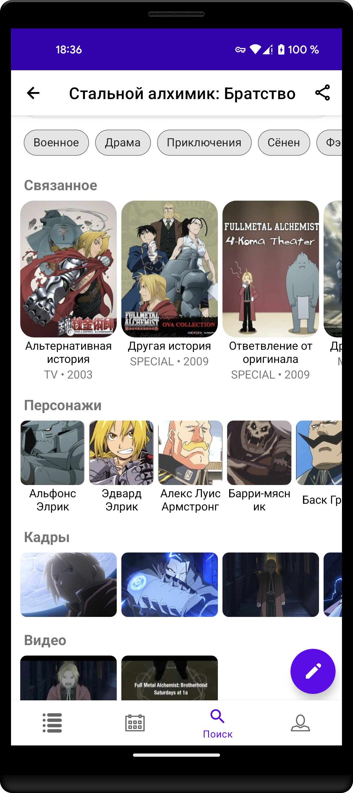
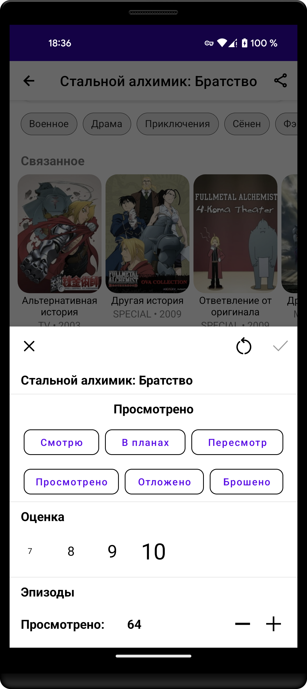
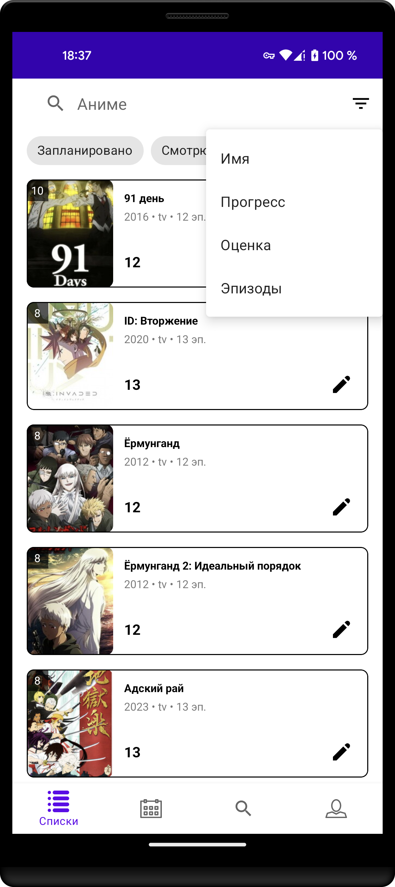

<h1 align="center" id="title">Daily Anime</h1>

<h2>Features</h2>

- Search anime by query and different filters
- Track your current progress of viewing anime
- Calendar of upcoming anime
- Discovery anime details and related things
- User statistic and history
- Night theme

<h2>Libraries that used</h2>

- Kotlin
- Coroutines
- Dagger 2
- Glide
- Retrofit
- Okhttp
- Room
- Firebase
- Android Architecture Components
- detekt

<h2>Future plans</h2>

- Home page
- Advanced preferences
- Onboarding
- Manga/Ranobe functionality
- Recap
- Achievements

<h2>Project Screenshots:</h2>

  
  
  
  
  
  
  

