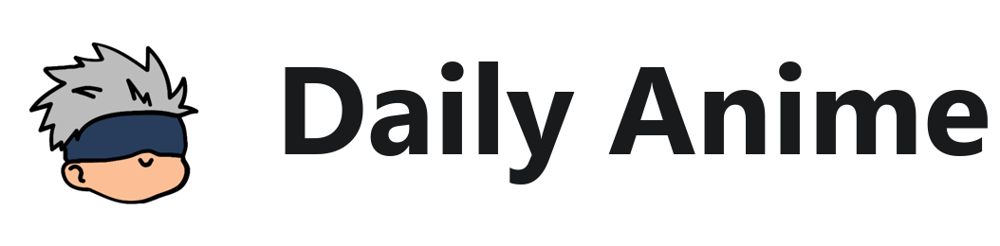
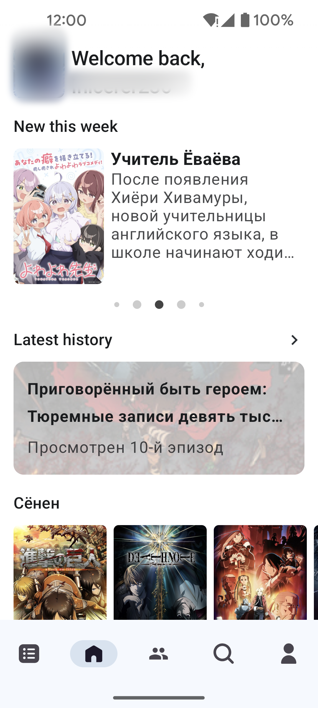
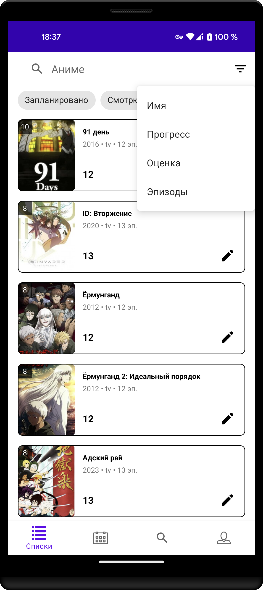
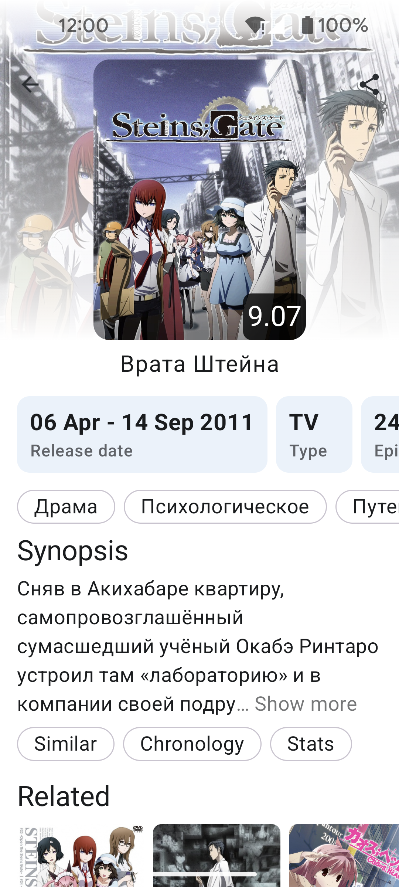
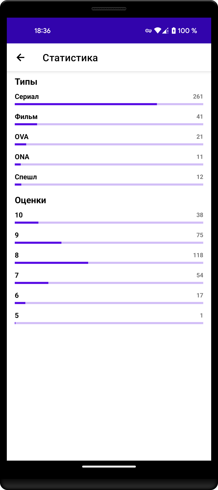
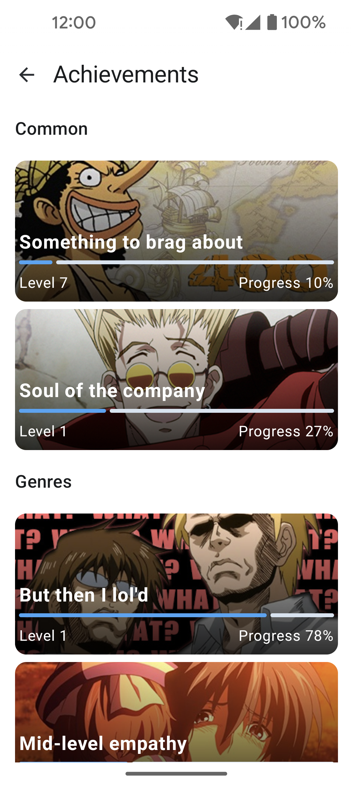
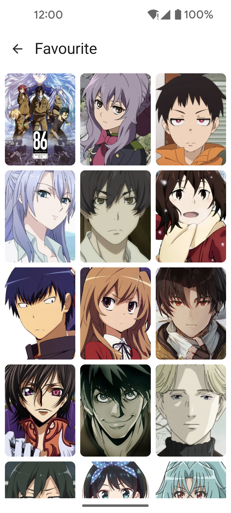
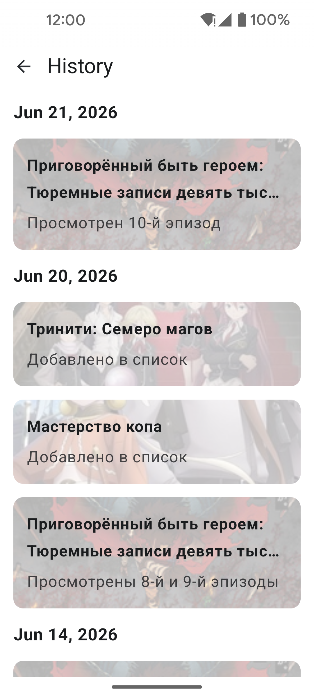

  <picture>
    <source media="(prefers-color-scheme: dark)" srcset="images/readme_logo_dark.png">
    
  </picture>

<h2>⚙️Features</h2>

- Search anime by query and different filters
- Track your current progress in viewing anime
- Calendar of upcoming anime
- Discovery of anime details and related info
- User statistics and history
- Night theme

<h2>🛠️Tech stack</h2>

- Kotlin
- Coroutines
- Dagger2
- Room
- Android Architecture Components
- Glide
- Retrofit
- Okhttp
- Jetpack
- Compose
- Firebase

<h2>🔮Future plans</h2>

- [x] Fancy stats
- [x] Onboarding
- [x] Migration to Material3
- [ ] Manga/Ranobe functionality
- [ ] Widget
- [ ] User recap
- [ ] Tech improvements
- [ ] Anilist API
- [ ] News
- [x] Migrate rest app to compose
- [ ] Modularization
- [ ] KMP
- [x] Favourites
- [ ] Customization in settings
- [x] Achievements

<h2>🎨Project Screenshots:</h2>

  
  
  
  
  
  
  
  

