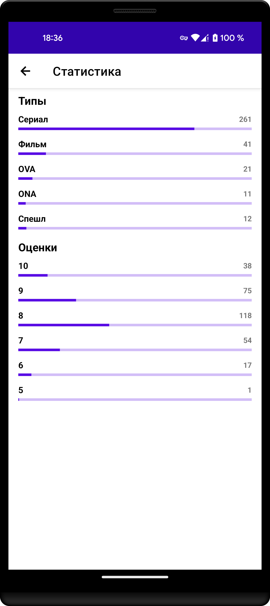

<h1 align="center" id="title">Daily Anime</h1>

<h2>⚙️Features</h2>

- Search anime by query and different filters
- Track your current progress in viewing anime
- Calendar of upcoming anime
- Discovery of anime details and related info
- User statistics and history
- Night theme

<h2>🛠️Tech stack</h2>

- Kotlin
- Coroutines
- Dagger2
- Room
- Android Architecture Components
- Glide
- Retrofit
- Okhttp
- Jetpack
- Compose
- Firebase

<h2>🔮Future plans</h2>

- [x] Support of English localization
- [x] Migration profile and search to Compose
- [ ] Home page
- [ ] Onboarding
- [ ] Migration to Material3
- [ ] Achievements
- [ ] Manga/Ranobe functionality
- [ ] Widget
- [ ] User recap
- [ ] Tech improvements

<h2>🎨Project Screenshots:</h2>

  
  
  
  
  
  
  

